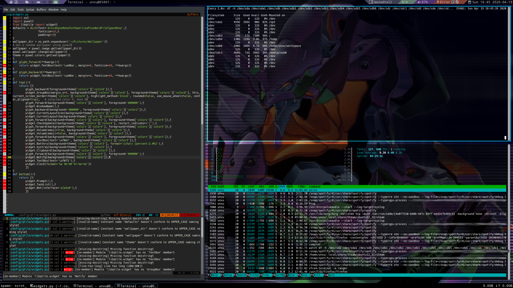

# dotfiles
User config files.
# Contents
## .bashrc - Configuration for Bash ##
Features:
* Handy alias `rebash` for quickly reloading the config.
* Minimalistic exit code reporting at the begining of the prompt.
* Customized PS1 prompt colors: Changes the username to red after becoming `root`
## .dircolors - Colour definitions for ls. ##
* A color scheme that matches the prompt.
## .fonts ##
User font directory. Mainly for patched and icon fonts.
## .config/qtile ##
Configuration files for the tiling window manager qtile. Features:
* Modular config.
* Uses pywal to set the wallpaper and dynamically color the widgets.
* Autostarts `compton` for window compositing.
* Eye-candy with Powerline glyphs and FontAwesome icons.

