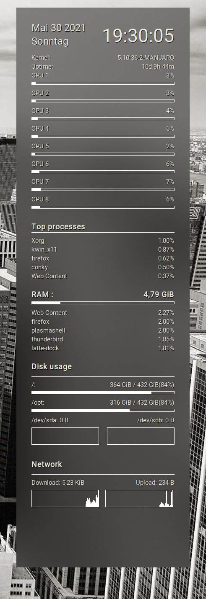

# dotfiles

User config files.

## Usage

To track changes on the files use a bare git repository. This decouples the git
repository files from the working tree. In this way you can track changes on
the config files your programs are using without turning the home directory into
a repository.

Create directory to store the repository.

```bash
mkdir .dotfiles
git init --bare .dotfiles
```

Create an alias to work on the dettached mode.

```bash
alias dotfiles='/usr/bin/git --git-dir=$HOME/.dotfiles --work-tree=$HOME'
```

The file `.bash_aliases` contains this alias so that it is persistent between sessions.

Ignore files that are not already in the repository, like personal documents.

```bash
dotfiles config --local status.showUntrackedFiles no
```

Add remote location. In this case the URL is the one I will use for SSH pushes.

```bash
dotfiles remote add origin git@github.com:javiunzu/dotfiles.git
```

Synchronize and track the remote branch:

```bash
dotfiles pull origin master
```
Change files and submit changes using the alias instead of the unaliased git.

## Contents

### .bashrc - Configuration for Bash ##

Features:

* Handy alias `rebash` for quickly reloading the config.
* Minimalistic exit code reporting at the begining of the prompt.
* Customized PS1 prompt colors: Changes the username to red after becoming `root`

### .dircolors - Colour definitions for ls. ##

* A color scheme that matches the prompt.

### .fonts ##

User font directory. Mainly for patched and icon fonts.

### .config/conky

Files for the system monitor. Features:

* All the information I need.
* Blur effect (use `conky.sh`)



### .config/qtile ##

Configuration files for the tiling window manager qtile. Features:

* Modular config.
* Uses pywal to set the wallpaper and dynamically color the widgets.
* Autostarts `picom` for window compositing.
* Eye-candy with Powerline glyphs and FontAwesome icons.


